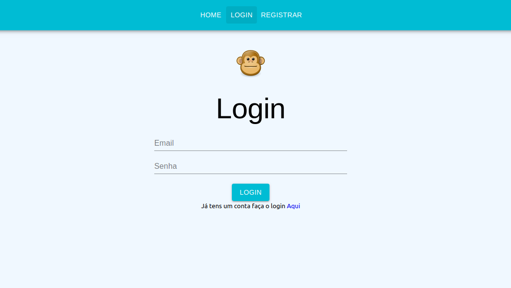
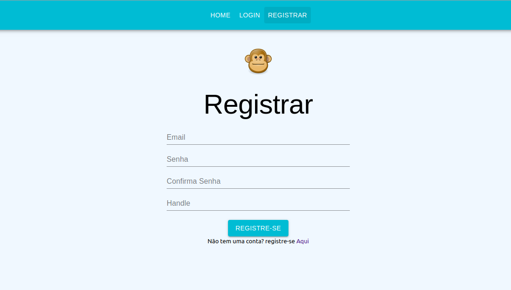

# ReactSocial
-- Servidor para manipular rotas de login, registro de novos usuários, upLoad de imagens e visualização de telas, notificações
- Firebase
- Express 
- Nodejs 
- Busboy
## App React frontEnd que vai utilizar a api criada social-back

     
     
  <h2 align="center">  </h2>

